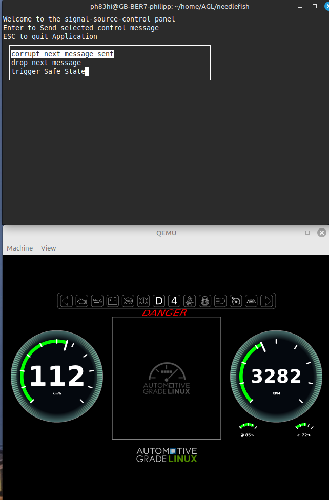

### How to build

repo init https://github.com/elisa-tech/elisa-agl-repo.git -b trout

source meta-agl/scripts/aglsetup.sh -m \<machine\> elisa-cluster-demo

example: source meta-agl/scripts/aglsetup.sh -m qemuarm64 elisa-cluster-demo

bitbake elisa-cluster-demo-qt

### How to test

After successful buid, use the command

runqemu --> to run the image in qemuarm64

login to the qemu.

run the command
"Signalsource-control-panel" -- This is a terminal based application. With this you can able to send signal to cluster.

Below is screenshot

